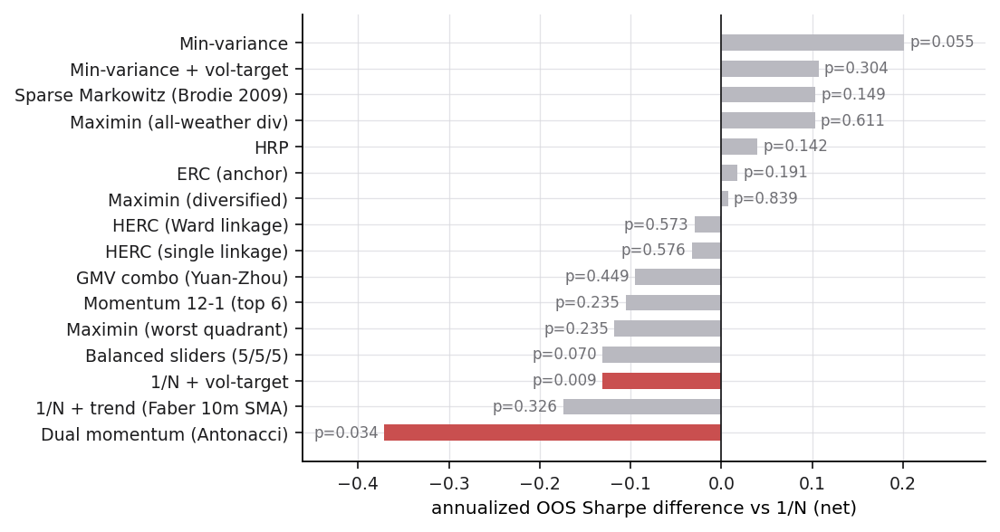
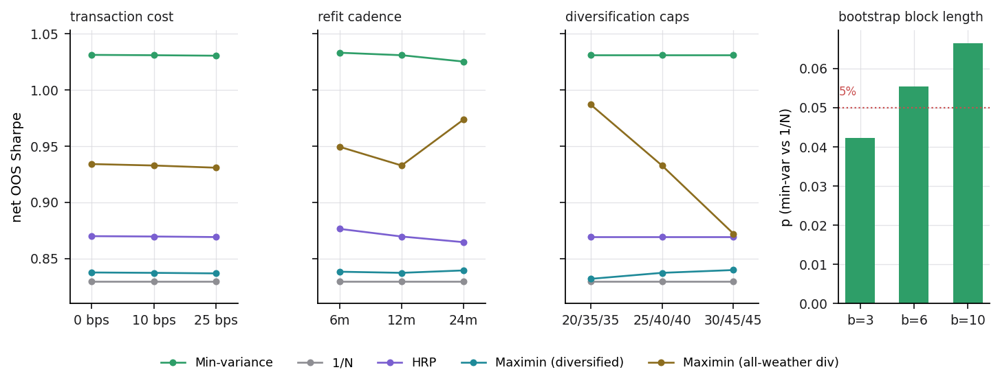
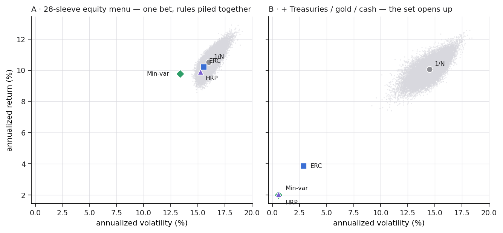
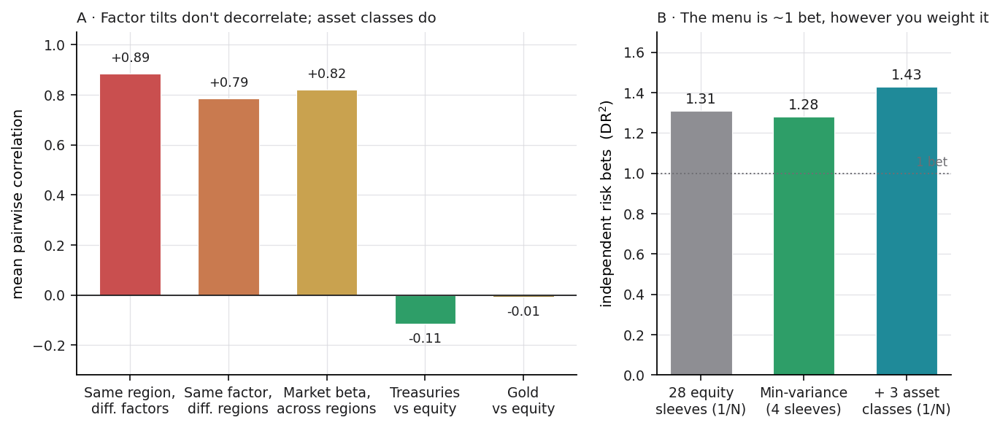
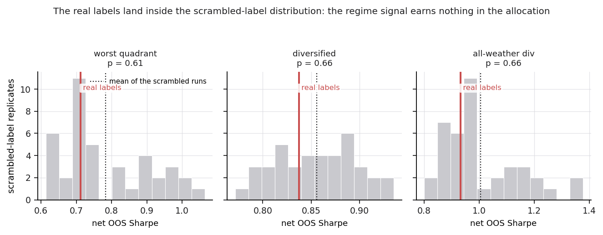
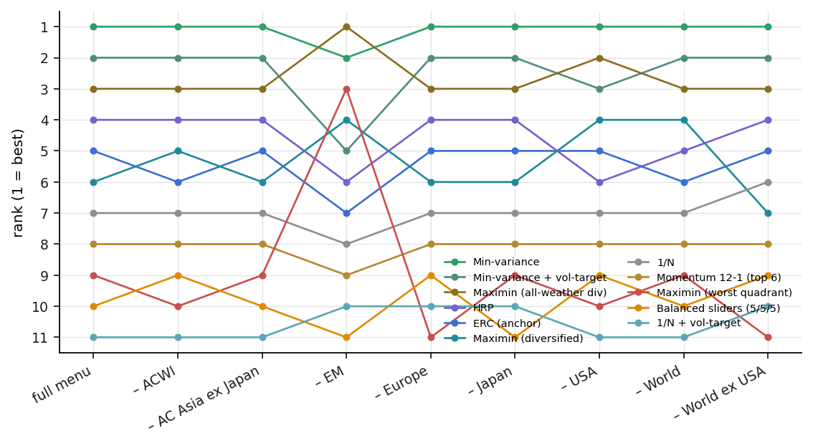
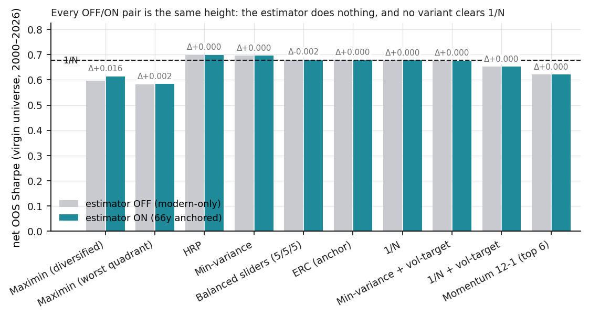

# Dispersion, Not Method: When Portfolio Optimization Cannot Beat Equal Weight on an Investable Factor Menu

**Working paper — draft v0.4 (2026-08). Prepared for SSRN; target outlets: *Journal of
Portfolio Management* / *Journal of Asset Management*.**

*Author: [owner]. Every number in this paper is an entry in the project's critical-findings
ledger (M1-M37), names the module that produces it, and regenerates from public data with one
command. Repository: [URL on publication].*

---

## Abstract

Twenty years after the naive-diversification debate began, we ask not whether portfolio
optimization beats equal weighting, but where, and why. On the menu a real investor can
actually buy, 28 long-only regional factor index funds over roughly 28 years of monthly
data, no optimization rule beats equal weighting at conventional significance, and several
popular overlays do significantly worse. The cause lies in the menu rather than in the
optimizer. These funds hold the equivalent of only 1.3 independent risk bets, because
long-only factor tilts inside a region move together at a correlation of 0.885. Almost no
dispersion is left for any weighting scheme to exploit. Widening the menu restores it: adding
Treasuries and gold moves the lowest pairwise correlation from 0.53 to −0.14, and the
resulting portfolio earns a 0.95 Sharpe ratio at a 16.7% maximum drawdown. Optimization wins
where dispersion exists, and an investable factor menu has almost none. Widen the menu before
refining the weights.

**Keywords:** portfolio choice, estimation error, naive diversification, diversification
ratio, backtest overfitting, replication. **JEL:** G11, C58.

---

## 1. Introduction

Whether portfolio optimization beats naive equal weight is one of the longest-running
unresolved questions in asset allocation, and the disagreement is unusually sharp. DeMiguel,
Garlappi & Uppal (2009) found that across fourteen models and seven datasets nothing
consistently beats 1/N out of sample, and the most recent replication, on the original
datasets extended twenty years through the global financial crisis and the pandemic, reaches
the same verdict (Gelmini & Uberti, 2024). An equally serious literature holds that the result
is an artifact. On that account 1/N wins only because the optimizers were fed short-window
sample means (Kritzman, Page & Turkington, 2010), or because they were tested in high-turnover
forms that transaction costs destroy (Kirby & Ostdiek, 2012). Both sides show real
out-of-sample evidence. The debate has stayed open because it has been argued as though it had
a single answer.

It does not, and this paper locates the answer. Whether optimization beats 1/N turns on five
things: the dispersion of the asset menu, the length and quality of the estimation inputs, how
much turnover the strategy generates, whether short sales and leverage are permitted, and how
demanding a bar "beat" must clear. Fix all five at the position a real retail investor
occupies, a **long-only, index-based, factor-tilted equity menu** with realistic data length,
transaction costs charged and statistical significance required, and the question has a clean
and, we show, inevitable answer. On that menu no weighting rule beats 1/N. The cause is a
property of the menu itself, which holds about one independent bet, leaving no dispersion for
any scheme to exploit. The optimization defenders are right on their datasets, where
dispersion is high. We are right on ours, where it is not. The two findings are compatible
once the opportunity set is named. This is the paper's spine, and Section 6 measures it
(Figures 3 and 4).

We reach it by fielding the canonical construction rules, together with the three most-cited
rules built specifically to beat 1/N, against each other under one protocol, attaching a
p-value to every ranking sentence. Our contributions are three.

1. **The reconciling finding: dispersion, not method.** We measure why 1/N is unbeatable on
   an investable factor menu. The diversification ratio implies 1.31 independent bets,
   long-only factor tilts co-move at 0.885, and the covariance is near-singular. The
   mechanism is confirmed by contrast: adding three asset classes moves the menu's minimum
   pairwise correlation from 0.53 to −0.14. This places the twenty-year 1/N debate on a single
   axis, the opportunity set.

2. **A fully-instrumented adjudication.** We run the following as standing diagnostics on every build: Ledoit-Wolf (2008) bootstrap Sharpe inference (the robust successor to
   the Jobson-Korkie test the prior replication uses), deflated Sharpe ratios (Bailey & López
   de Prado, 2014), a Friedman-Nemenyi joint test (Demšar, 2006), CSCV backtest-overfitting
   probability (Bailey et al., 2017), leave-one-region-out re-races, and sensitivity grids over
   costs, refit cadence, constraints, block length and the covariance estimator. Under it, all
   three published "beat-1/N" rules we field fail. Yuan & Zhou's (2023) combination loses
   outright, Brodie et al.'s (2009) sparse portfolio reaches only p = 0.149, and HERC lands
   below both its parents.

3. **Two null results, reported in full.** We build, freeze and pre-register a
   regime-conditioned shrinkage estimator, then attack it, and the macro regime signal it
   depends on, with placebo tests aimed at our own signature feature. Both return nothing
   resolvable at this sample size. We report the negative result with a power post-mortem.

Section 2 places the paper in the five-lever debate. Sections 3 and 4 give the data and the
protocol, Section 5 runs the race, and Section 6, the contribution, measures why it comes out
the way it does. Sections 7 and 8 report the nulls and the robustness checks.

## 2. The debate and its five levers

The two camps rarely engage on the same terms. On one side, DeMiguel et al. (2009) and, most
recently, Gelmini & Uberti (2024) find 1/N is not systematically beaten out of sample. On the
other, Kritzman, Page & Turkington (2010), titling their rebuttal "the fallacy of 1/N", and
Kirby & Ostdiek (2012) show optimization can win. Read together, their disagreement concerns
experimental conditions, and it resolves into five levers. (i) *Menu dispersion*: DeMiguel's own explanation, quoted approvingly by Gelmini &
Uberti, is that optimization improves relative to 1/N when idiosyncratic volatility is high and
the covariance is far from singular. (ii) *Estimation inputs*: Kritzman et al. locate 1/N's
edge in short-window sample means. Gelmini & Uberti test the lever directly and find a growing
window helps the optimizers without producing a systematic win. (iii) *Turnover*: Kirby &
Ostdiek attribute the result to the extreme turnover of the strategies DeMiguel tested.
(iv) *Short sales and leverage*: much of the measured optimization advantage requires positions
a long-only investor cannot take. (v) *The significance bar*: pro-optimization evidence is
often point-estimate or single-dataset, whereas the humility side demands significance across
datasets. Pflug, Pichler & Wozabal (2012) supply the theory the humility side otherwise lacks,
showing 1/N optimal under sufficient model ambiguity, which is the regime a retail investor
with a few decades of data inhabits. We fix all five levers at that retail position.

**Estimation error.** Markowitz (1952) optimality collides with sampling error (Michaud, 1989;
Chopra & Ziemba, 1993), which DeMiguel et al. (2009) quantify. Yuan & Zhou (2023) supply the
missing theory. The plug-in Sharpe converges to τ·SR with τ = √((1−η)/(1+η/SR²)) and η = N/T,
and under a one-factor structure 1/N is asymptotically optimal as N grows. They then beat 1/N
with a closed-form combination of the plug-in GMV portfolio and 1/N. We field their rule
(Section 5), where it loses on our menu, an outcome their own Proposition 3 and their T = 360
window requirement predict in advance. The humility result therefore survives its strongest
published challenger, adjudicated with that challenger's mathematics.

**Menu selection.** A weighting study is only as interesting as its menu. Ilmanen & Kizer
(2012) report average correlation near zero across *factor* constituents against roughly 0.4
across asset classes, which is why a factor-spanning menu should diversify more per slot. We
measure our own menu with the metric that literature standardized, the Choueifaty & Coignard
(2008) diversification ratio, whose square estimates the number of independent risk bets.
Section 6 shows that the long-only wrapper destroys most of the effect. Hurst, Ooi & Pedersen
(2017) point at a diversifier we do not hold. We field the rule form of trend here and flag the
asset form as the more promising route.

**Structural weighting rules.** Risk-parity and ERC (Maillard, Roncalli & Teïletche, 2010;
Asness, Frazzini & Pedersen, 2012), hierarchical risk parity (López de Prado, 2016) and
minimum variance (Clarke, de Silva & Thorley, 2006), whose success the low-volatility anomaly
explains (Haugen & Baker, 1991; Frazzini & Pedersen, 2014), win by imposing structure instead
of estimating means. Antonov, Lipton & López de Prado (2024) supply the theory HRP lacked,
showing analytically that its weights carry less estimation-induced noise than plug-in
Markowitz's. Raffinot (2018) hybridizes the two families as HERC, with a gap-index cluster
count after Tibshirani, Walther & Hastie (2001). We field both linkages, since reporting only
the flattering one is how hyperparameters get hidden.

**Constraints, sparsity and shrinkage.** Jagannathan & Ma (2003) showed weight constraints act
as covariance shrinkage, and we measure the effect prospectively in Section 5.2. Brodie et al.
(2009) regularize Markowitz with an ℓ1 penalty and outperform 1/N on 48 industry portfolios,
but that penalty is inert without shorting (Section 4.2), which makes them the selecting
sibling of our spreading constraints and the natural contestant to field with the two things
their claim lacked, a Sharpe-difference test and transaction costs. DeMiguel, Garlappi,
Nogales & Uppal (2009) are the norm-constrained cousin. On the input side, Jorion (1986) and
Frost & Savarino (1986) shrink means toward within-sample grand means, whereas ours
(Section 4.1) shrinks conditional means toward another era's evidence under a pretest gate in
the Judge & Bock (1978) lineage. Boyd et al. (2024) show what Markowitz looks like when the
inputs are genuinely there, with factor risk models, explicit robustness terms and an
engineering budget, which is a useful foil for the opposite regime we study.

**Regime models and inference.** Ang & Bekaert (2002, 2004) established that regimes matter for
allocation, and Guidolin & Timmermann (2007) extended the latent-state machinery. We differ in
kind, using an observable deterministic classifier and pooled sample means, with nothing fitted
to predict. For inference we implement, in code, Ledoit & Wolf (2008), Bailey & López de
Prado (2014), Bailey et al. (2017), Demšar (2006) and Politis & Romano (1994). Ledoit & Wolf's
(2020) analytical nonlinear shrinkage enters as a sensitivity dimension on the covariance
estimator every risk number rides on.

## 3. Data and the investor's constraint set

The menu is not an arbitrary choice of dataset. It is a *position*, and the paper's question
only means something once that position is stated. We study a retail investor who is
**long-only, unlevered, index-based and long-horizon**, the constraint set of someone buying
liquid, low-cost ETFs rather than running a book. We price the equity-heavy stance without recommending it. Our scenario cones put an equity profile's probability of cumulative loss at ≈14%
at 5 years against a defensive multi-asset profile's 1.4%, but at 20 years the two are 1.2%
and 0.0% with the equity profile's median CAGR still materially higher (≈9.7% vs 7.3%). Two
honesty notes belong with that number. Converging *loss probability* is not converging *risk*,
since terminal-wealth dispersion grows with horizon, and these are simulations under a
re-sequenced-history assumption, and they are not forecasts.

The factor tilts are justified by documented return premia and not by diversification: value
and size (Fama & French, 1993), momentum (Jegadeesh & Titman, 1993) and quality (Asness,
Frazzini & Pedersen, 2019), with Asness, Moskowitz & Pedersen (2013) supplying the strongest
anti-data-mining defence. On our own sleeves every factor beats its regional Reference in CAGR
over the full window (Enhanced Value +3.70pt, Momentum +2.88pt, Quality +1.47pt, winning in
7/7, 7/7 and 6/6 regions). The backfill-free check is the honest half. Restricted to the
live-index era (2015+) the premia **shrink but survive**, with Momentum +3.38pt, Enhanced
Value +1.76pt and Quality +1.04pt, the last winning in only 4 of 6 regions. That attenuation is
consistent with McLean & Pontiff's (2016) post-publication decay, and it is the magnitude a
prospective investor should plan around. Section 6 measures that in long-only form these tilts
do not diversify.

**Sources.** The modern menu is 28 MSCI region×factor indices (ACWI, World, World ex-USA, USA,
EM, Europe, AC Asia ex-Japan, Japan × Reference / Momentum / Enhanced Value / Quality where
available), monthly net-USD total returns, common window 1999-01–2026-06 (330 months). Its
measured redundancy disciplines its interpretation: mean pairwise correlation 0.76, first
principal component 77% of variance, ≈2.8 effective bets. Sixteen FRED indicators feed a
4-quadrant growth×inflation classifier, used for descriptive statistics only with no fitted
latent-state model. For long history we use Ken French research factors (1926+) and six
long-only size×value portfolios, 10-year US Treasury total returns constructed from the FRED
yield by the Swinkels (2019) par-bond approximation (sanity: 2008 +21%, 2022 −16%), LBMA gold
and T-bill returns. These are research constructs and never investable sleeves. The classifier
labels months from 1960 (789 months, 2.4× the modern window, containing the actual 1970s
stagflation). Finally, a **virgin confirmatory universe**: nine Ken French international
sleeves ({Europe, Japan, Asia-Pacific ex-Japan} × {market, value, momentum}, USD, monthly,
1990-11 onward), never downloaded or inspected during development, with the test protocol and
thresholds committed to the repository before the single run (Section 8).

## 4. Method

### 4.1 The regime layer and a pre-registered estimator

Growth and inflation composites (z-scored, sign-adjusted trends of several indicators each)
define four quadrants: Goldilocks, Reflation, Deflationary bust and Stagflation, with soft
probabilities and an empirical monthly transition matrix. Two design facts matter downstream.
The classifier is deterministic and identical across eras, and its per-quadrant factor patterns
are structural, with 15 of 16 factor×quadrant sign cells agreeing between 1960-2026 and the
modern window. The single flip is the market factor in stagflation.

On top of it we build, freeze and pre-register a transparent estimator for the noisiest objects
in the exercise, the per-regime conditional means, at 30-90 monthly observations per cell. We
state it because Section 7.2 reports that it has **no effect resolvable at this sample size**,
and the construction and its null result are inseparable. For a factor sleeve i in state s with
modern conditional excess ê_is over its region Reference, long counterpart j with 66-year state
mean f̄_js, modern-window restriction f̄'_js, sample sizes n_s and m_s, and mapping
coefficient β_j:

    gate:   g_js = 1{ sign(f̄_js) = sign(f̄'_js) }
    blend:  ẽ_is = g_js · [n_s ê_is + m_s β_j f̄_js] / (n_s + m_s) + (1 − g_js) · ê_is

This is empirical-Bayes pooling with prior strength equal to months of long evidence, plus a
pretest gate on the crudest sufficient statistic. It feeds the Black-Litterman (1992) view
vector and the worst-quadrant objective's per-regime means, and reporting always shows raw
modern means. Full treatment, including the asset-class and no-counterpart cases, is in the
repository.

### 4.2 Contestants, protocol and inference

We field equal weight (1/N), minimum variance, ERC and HRP (all on Ledoit-Wolf 2004 shrunk
covariances), a mean-variance-derived balanced blend around a Black-Litterman posterior,
cross-sectional momentum (12-1, top-6), unlevered volatility targeting (Moreira & Muir, 2017),
binary trend overlays (Faber, 2007; Antonacci, 2014), worst-quadrant maximin both unconstrained
and under diversified caps (per-sleeve ≤25%, look-through geographic ≤40%, factor ≤40%), and an
all-weather diversified maximin on the menu extended with Treasury, gold and cash proxies. We
also field the three most-cited "beat-1/N" rules as contestants: the
Yuan-Zhou (2023) GMV combination, the Brodie et al. (2009) sparse portfolio (in long-only form
minimum variance at a target return, the ℓ1 penalty being inert), and HERC in both linkages.
Raw full-sample mean returns are forbidden as objective inputs throughout.

The protocol is an expanding-window walk-forward with a 120-month warmup, annual refits, every
input re-estimated on training data only, and returns net of 10 bps one-way transaction costs
on turnover. Companion races are a 90-year re-race on the proxy universe (OOS 1936-2026) with
shifted-start variants, hand-dated episode replays, and a regime-persistent stationary
bootstrap used as forward validator and never as objective. Inference is Ledoit-Wolf (2008) HAC
delta-method plus studentized circular block bootstrap (B = 4999, b ≈ T^⅓, sensitivity
b ∈ {3,6,10}) for every contestant against 1/N and against the incumbent winner, deflated
Sharpe with the fielded-roster trial count, and CSCV probability of backtest overfitting
(S = 16, 12,870 half-splits). Sharpes are excess-over-T-bill here and rf = 0 in internal tables.
Rankings are identical and the headline p-value moves 0.055→0.067, so all conclusions are
convention-robust.

## 5. The walk-forward race

### 5.1 The modern menu, 2009-2026 (M1, M14, M21)

Minimum variance tops the table, at a net out-of-sample Sharpe of 1.03 against 1/N's 0.83, and
no contestant's edge over 1/N is significant at 5%. Minimum variance reaches p_boot = 0.055 and
every other contestant p ≥ 0.14. The downside is detectable where the upside is not. Equal
weight plus volatility targeting is significantly worse than plain 1/N (p = 0.009), dual
momentum worse still (p = 0.034), and four contestants lose significantly to the winner. The
result holds jointly as well as pairwise. A Friedman test on 12-month block ranks rejects the
null that the ordering is noise (χ² = 46.6, p = 0.0001), yet the Nemenyi critical difference
clears no contestant past 1/N. The ranking is real while the gap to equal weight is not.
Deflated Sharpes of 0.98 and above clear the multiplicity bar, and the CSCV probability that
the in-sample-selected contestant is no better than the out-of-sample median is 33%, which is
real selection information well short of certainty.

**Table 1.** Walk-forward out-of-sample results, 2009-2026 (210 months), net of 10 bps
transaction costs. Δ Sharpe and p (studentized circular block bootstrap, Ledoit-Wolf 2008) are
against 1/N. DSR is the deflated Sharpe against the fielded roster. Sorted by Sharpe.

| Contestant | CAGR | Vol | Sharpe | maxDD | Δ Sharpe vs 1/N | p vs 1/N | DSR |
|---|---:|---:|---:|---:|---:|---:|---:|
| Min-variance | 13.8% | 13.5% | 1.03 | −28% | +0.20 | 0.055 | 1.00 |
| Min-variance + vol-target | 10.9% | 11.9% | 0.94 | −24% | +0.11 | 0.304 | 1.00 |
| Sparse Markowitz (Brodie 2009) | 12.6% | 13.8% | 0.93 | −26% | +0.10 | 0.149 | 1.00 |
| Maximin (all-weather div.) | 8.0% | 8.7% | 0.93 | −18% | +0.10 | 0.611 | 1.00 |
| HRP | 12.4% | 14.8% | 0.87 | −27% | +0.04 | 0.142 | 0.99 |
| ERC | 12.2% | 15.0% | 0.85 | −27% | +0.02 | 0.191 | 0.99 |
| Maximin (diversified) | 13.1% | 16.3% | 0.84 | −28% | +0.01 | 0.839 | 0.99 |
| **1/N** | 12.2% | 15.3% | 0.83 | −27% | — | — | 0.99 |
| HERC (Ward linkage) | 11.5% | 15.0% | 0.80 | −28% | −0.03 | 0.573 | 0.99 |
| HERC (single linkage) | 10.7% | 14.1% | 0.80 | −27% | −0.03 | 0.576 | 0.99 |
| GMV combo (Yuan-Zhou 2023) | 9.8% | 14.2% | 0.74 | −30% | −0.10 | 0.449 | 0.98 |
| Momentum 12-1 (top 6) | 10.8% | 16.0% | 0.72 | −29% | −0.11 | 0.235 | 0.97 |
| Maximin (worst quadrant) | 12.4% | 18.9% | 0.71 | −28% | −0.12 | 0.235 | 0.98 |
| Balanced sliders | 11.2% | 17.3% | 0.70 | −27% | −0.13 | 0.070 | 0.97 |
| 1/N + vol-target | 8.5% | 12.9% | 0.70 | −26% | −0.13 | **0.009** | 0.96 |
| 1/N + trend (Faber 10m SMA) | 6.8% | 11.0% | 0.66 | −20% | −0.17 | 0.326 | 0.95 |
| Dual momentum (Antonacci) | 5.4% | 13.3% | 0.46 | −27% | −0.37 | **0.034** | 0.81 |

***Figure 1.*** *Annualized Sharpe difference against 1/N for every contestant, with the
Ledoit-Wolf bootstrap p-value on each bar. Nothing clears significance above the line. The two
red bars are the overlays that are significantly worse than doing nothing.*

None of the three most-cited rules designed to beat 1/N does so on this menu. The **Yuan-Zhou
(2023) combination loses outright** (0.74 against 0.83, p = 0.45), which their own theory
predicts where the estimation window is short and the menu one-factor-dominated, and we
declared the prediction before running. **Brodie et al.'s (2009) sparse portfolio** reaches
third place (0.93) at only p = 0.149, so their "significantly and consistently" does not
survive the Sharpe-difference test and the transaction charge they never applied. **HERC**
lands below both its parents.

Two mechanical facts explain why nothing separates. The contestants' out-of-sample returns are
0.93 to 0.998 correlated with one another. HRP and ERC at 0.998 are one portfolio under two
names, and Brodie and minimum variance at 0.975 earn from the same USA Quality sleeve, so the
seventeen-row table is roughly four distinct strategies, and no Sharpe test can pull apart
series that move together this closely. Attribution then shows what the winner actually is.
Minimum variance earns **82% of its out-of-sample return in Quality sleeves** (USA 52%,
World 30%), which is the low-volatility-anomaly mechanism made visible: a defensive factor bet
carrying an optimizer's name. Both facts point past the optimizer to the menu, which
Section 6 measures.

### 5.2 Long history and the constraint grids (M2, M3, M17)

Re-raced over 1936-2026 on six long-only Fama-French portfolios, minimum variance falls to last
among structural rules (0.71) while HRP (0.76) and ERC (0.75) edge 1/N (0.74). Across
shifted-start variants **HRP and ERC beat 1/N in 100% of windows and minimum variance in 25%**.
The modern menu shows the same signature in rolling windows, with ERC and HRP beating 1/N in
98 to 99% of rolling three-year windows. Structure is the property that travels, and the modern
winner does not.

***Figure 2.*** *Left: net out-of-sample Sharpe across every grid cell (costs, refit cadence,
cap levels), where no ranking conclusion flips. Right: the one genuine frontier, the headline
p-value's sensitivity to bootstrap block length.*

Constraints behave as Jagannathan & Ma (2003) predicted, measured prospectively rather than
in-sample. The capped maximin beats its unconstrained twin out of sample in every
sensitivity-grid cell, by +0.115 to +0.132 Sharpe across costs of 0/10/25 bps, refits of
6/12/24 months, and cap levels 20/35/35 through 45/45. No grid cell flips any ranking
conclusion. The single genuine frontier is the headline p-value's block-length sensitivity
(0.042/0.055/0.066). We report the range and do not choose a block length.

## 6. The opportunity set (M18, M27, M34)

***Figure 3.*** *Every long-only portfolio you could build (grey cloud, 40,000 random
weightings) plus the fielded rules, on a shared scale. **Left:** the 28-sleeve equity menu is a
narrow sliver, and every rule piles into the same corner. **Right:** adding Treasuries, gold and
cash opens the set and the rules spread apart. (Full-sample geometry; the cloud is the
achievable set, not a frontier estimate.)*

Why does no weighting rule beat 1/N here, when the literature's optimization defenders show
that it can? Because on an investable long-only factor menu there is almost nothing to
optimize. We measure it three ways.

***Figure 4.*** *The same fact in numbers. **A:** the most correlated cut of the menu is
same-region/different-factors (0.885), and only the non-equity sleeves are genuinely different
bets (Treasuries −0.115, gold −0.007). **B:** independent risk bets (DR²), where the 28-sleeve
menu holds 1.31 and minimum variance's four sleeves hold 1.28. Twenty-four extra equity
sleeves buy 0.03 of a bet, and three asset classes buy more than all of them.*

**First, correlation structure.** The highest-correlated cut of the entire menu is *same
region, different factors*. Value, momentum and quality within one country co-move at 0.885,
higher than the same factor across regions (0.786) or pure market beta across regions (0.821).
Long-only factor tilts do not decorrelate, because each index is roughly its parent market plus
a small tilt, and the market beta dominates. The three non-equity proxies are the only
genuinely different bets on the menu, with Treasuries correlating −0.115 with the 28 equity
sleeves and gold −0.007.

**Second, independent bets.** The Choueifaty-Coignard diversification ratio squared, the
effective number of independent risk bets, is **1.31** for the equal-weighted equity menu and
**1.28** for the four-sleeve minimum-variance portfolio. The engine whose entire job is to
exploit correlations to cancel risk, holding a quarter as many sleeves, finds no more
independent bets than naive diversification does. Twenty-four extra equity sleeves buy 0.03 of
a bet. The first principal component alone explains 77% of variance, and the covariance matrix
is near-singular, with a smallest eigenvalue of 3×10⁻⁷.

**Third, the contrast that identifies the mechanism.** Adding the three asset-class proxies
moves the menu's minimum pairwise correlation from 0.53 to −0.14 and its diversification ratio
to 1.43. Three sleeves buy more independent-bet content than twenty-eight equity sleeves did.

### 6.1 The long-only wrapper

The literature that motivates factor investing measures *long-short* portfolios, in which
buying the favoured stocks and shorting their opposites removes the market beta and leaves the
premium. An investor who cannot short holds the premium together with the parent market, and
the beta dominates whatever the tilt contributes. We measure the consequence three independent
ways, and they agree. *(i) Across factors:* Ilmanen & Kizer (2012) report near-zero correlation
across factor constituents, whereas on long-only sleeves the within-region cross-factor
correlation is **0.885**, the highest cut of our menu. *(ii) Value against momentum:* Asness,
Moskowitz & Pedersen (2013) report ≈ **−0.50** between the two long-short premia, the standard
argument for holding both. On our sleeves the correlation is **−0.088** once each is measured
in excess of its parent index, about a fifth of theirs, and **+0.820** in the space an investor
actually holds. The hedge is not merely weakened. In investable form its sign reverses.
*(iii) The defensive factor:* Quality's excess over junk is positive in drawdowns in long-short
form, but long-only Quality carries a beta of **0.91** and *falls in 6 of 6 regions* during the
worst decile of market months, cushioning **0.91 percentage points** (−7.95% against the
Reference's −8.87%). A cushion of that size is attenuation and cannot serve as a hedge.

Beta dominance is the mechanism the headline result rests on, and it is why the diversification
the factor literature promises is largely unavailable in the form a retail investor can buy.

### 6.2 The reconciliation

This is the paper's central claim, and it settles the twenty-year debate. Optimization beats 1/N exactly where there is dispersion to exploit, on the industry and
factor-portfolio datasets of its defenders, where idiosyncratic volatility is high and the
covariance is well-conditioned, which is Gelmini & Uberti's own explanation (Section 2). An
investable factor menu is the opposite regime, with one dominant bet, a near-singular
covariance, and no dispersion for any weighting scheme to convert into an edge. The
disagreement in the literature concerns the opportunity set, and the retail factor investor
sits squarely in the region where 1/N cannot be beaten.

The practical corollary concerns selection: **widen the menu before refining the
weights.** Three asset classes buy more independent-bet content than
twenty-eight equity sleeves, and no amount of estimator sophistication substitutes.

## 7. The extended menu and two null results

### 7.1 A worst-case objective over a regime-diverse menu (M6, M7)

The one construction that measurably changes the risk profile does so through the menu rather
than through regime information. Within equities alone the stagflation floor was a concentrated
Value bet, and forcing diversification collapses it (+0.31 to +0.02%/month). Extending the menu
with Treasuries and gold restores the floor at half the volatility, with century-scale shape
evidence behind it: a static all-weather archetype returned +9.8% through OPEC 1973-74 while
60/40 lost 28.5%. As a walk-forward contestant the resulting flagship, a capped worst-quadrant
portfolio over equities, Treasuries and gold, delivers **Sharpe 0.95 at 8.7% volatility with a
−16.7% maximum drawdown**, is statistically indistinguishable from the era-flagged winner
(p = 0.70) at two-thirds of its volatility, and holds the lowest drawdown in Table 1.

Those numbers stand, and their explanation is where we correct ourselves. The worst-quadrant
objective maximizes the mean of the worst of four macro partitions of history, but that
objective is a robustness device even when the partitions are meaningless. A capped worst-case
allocation over a menu containing genuinely negatively-correlated assets is pushed toward those
assets under any four-way partition, because they are what a worst-case floor rewards. The
flagship's record belongs to the regime-diverse menu and not to knowledge of the regime. The
practical statement survives fully: to buy a shallow-drawdown floor at this data scale, change
what you hold rather than how you time it.

### 7.2 Placebo tests of the regime layer (M32, M35)

***Figure 5.*** *The permutation test against our own signature feature. Grey: net
out-of-sample Sharpe across 40 replicates with the macro-state labels scrambled (circular
rotation, which preserves run lengths and the transition matrix exactly). Red line: the
real-label result. It sits inside the scrambled-label distribution, and below it for two of the
three contestants.*

The regime layer is this paper's most attackable feature, so we attack it ourselves and report
what the tests return. **The labels (M32):** re-running the entire walk-forward 80 times with
the macro-state labels scrambled, a circular rotation preserving marginal frequencies, run
lengths and the transition matrix exactly while destroying only the alignment between a month's
label and its returns, the maximin family performs no better with real labels than with random
ones. On both metrics (net Sharpe and the realized worst-real-quadrant floor the objective
actually optimizes), across twelve cells, the best permutation p is 0.195 and the real labels
sit below the scrambled mean in seven of twelve. The average randomly-labelled flagship
achieved a better worst-quadrant floor than the real one. Equal weight, which consumes no
labels, is bit-identical across all 81 runs, which serves as a leak check. **The estimator
(M35):** a paired difference-of-differences, switching the anchor off and on within each
replicate on the same labels, finds every real-arm effect under half a null standard deviation
and the estimator helping in 45 to 60% of replicates, a coin flip.

We report these because a checklist paper that ran the tests and withheld the answers would
refute its own thesis. The classifier's descriptive value, meaning which quadrant we occupy
and how factors have behaved per state, is a different claim and is not tested here. What the
placebos settle is narrow and clean. The macro signal does not earn its place in the
allocation, and the honest contribution is the negative result together with the apparatus that
produced it.

## 8. Robustness (M12, M13, M16, M19, M20)

***Figure 6.*** *Rank of each contestant when a whole region is dropped from the menu. The
structural rules hold their rank. The maximin family is the one that moves, so its record
traces to exposure.*

**Exposure and region dependence.** Sub-period splits and region correlations expose the
equity-only maximin as 1/N-like before 2024, correlated 0.93 with EM and lifted by the 2024+
rally. The leave-one-region-out re-race then inverts the naive story. Dropping EM improves every
maximin variant (all-weather 0.93 to 1.18, taking first place), so EM exposure was a net drag
the objective was systematically attracted into. The podium itself is stable across menus. Minimum variance is first in 8 of 9 menus, the all-weather never leaves the podium, and
no overlay beats 1/N on any menu.

**Real time and the live era.** Lagging regime labels two months, which is the realistic
macro-publication constraint, improves every regime-dependent contestant (all-weather 0.93 to
1.11 at 6.6% volatility), so the shipped results carry no look-ahead subsidy. Restricting
scoring to the live-index era (2015+, 138 months) preserves the hierarchy, which answers the
pre-launch-backfill critique with measurement.

***Figure 7.*** *Estimator OFF against ON on the never-touched Fama-French international
universe, on an honest full-height axis. Every pair is visually identical and nothing clears
1/N (dashed). The pre-registered Δ of +0.002/+0.016 sits inside the noise band Section 7.2
measures.*

**The pre-registered confirmatory test.** With protocol and thresholds committed before the
first run (CONFIRMS if every maximin variant's anchored-minus-modern ΔSharpe ≥ 0 with at least
one > +0.005; REFUTES if any < −0.02), the frozen estimator improves both variants on the nine
international sleeves (worst-quadrant +0.002, diversified **+0.016**) over 307 out-of-sample
months (2000-11 to 2026-05) containing the dot-com bust and the global financial crisis.
Verdict on its own terms: **CONFIRMS**. Section 7.2 then forces the power post-mortem. Those
declared thresholds sit inside the ±0.01-0.02 noise band that menu composition alone produces
(null standard deviation 0.03-0.10). The discipline was sound and we keep it as an example. The
lesson we draw against ourselves is that its thresholds were set below the noise floor, so
clearing them was a correctly-run test of a question it did not have the power to answer. Any
future confirmatory test in this program must declare thresholds against a measured null.
Reported ungated: nothing beats 1/N significantly there either (best p = 0.246), and the
equity-only maximin family ranks last through the two bears, consistent with Section 6.

## 9. Limitations

The modern out-of-sample window contains no prolonged bear. The proxy race and the virgin
universe (two bears) are the complements, though proxies are frictionless constructs. The
classifier carries a mild full-sample z-normalization, affecting scale and never direction and
bounded by the real-time lag test, and it uses revised rather than vintage FRED values, so an
ALFRED-vintage replay is future work.

**MSCI factor indices carry pre-launch backfill,** and the concern is real: a provider
launching a factor index in the mid-2010s computes its earlier history knowing which factor
definitions had worked. We offer two defenses, one measured and one structural. Measured:
restricting scoring to the live-index era leaves the hierarchy intact, with minimum variance
still first, the all-weather flagship still second, and HRP still above ERC still above 1/N, so
no conclusion here depends on backfilled months. Structural: every headline result replicates
on Ken French portfolios, which are continuously computed and have no launch date to backfill
from. What backfill can still do is inflate the level of factor-sleeve returns before 2015. It
cannot manufacture the relative ordering of construction rules applied to the same sleeves,
which is the object of study.

Costs are flat 10 bps on refit turnover. Within-interval drift turnover is uncharged but
measured immaterial, with a largest Sharpe overstatement of 0.002. Taxes, spreads and tracking
error are not modeled, and all results are USD. The deflated-Sharpe trial count includes
fielded contestants and not every development-time variant, so the pre-registered test is the
stronger multiplicity defense.

Our factor menu is the set with liquid, long-only MSCI indices, covering market, value,
momentum and quality rather than the full factor zoo, and a referee will ask about growth, size
or low volatility. The diversification-ratio result answers the class of objection directly:
more long-only tilts on the same market beta would land at the same ≈0.88 correlation as the
ones we hold and add no independent bets, so the verdict is coverage-robust. Growth is the
weakest such case, being the low-premium short leg of value rather than a separate premium.
Size is tested in the 90-year proxy race, and low volatility is precisely what the
minimum-variance contestant harvests. What changes a menu's character is another asset class, which is
the finding. Finally, equal weight is menu-relative
and the menu is a design layer. Our selection principle, spanning distinct risk sources
measured as effective bets, is stated and not optimized. A study of weighting rules on a menu
of roughly one bet is by construction a study of small differences, and readers should discount
our effect sizes accordingly.

## 10. Conclusion

Two decades of argument over whether optimization beats equal weight have a resolution this
paper can state precisely. It depends on the opportunity set, and on an investable long-only
factor menu, where a real retail investor lives, the set holds one dominant bet, so no
weighting rule can beat 1/N and, tested properly, none does. The finding is a property of the
menu and not a limitation of any optimizer, and we measure it (a diversification ratio of 1.31,
factor tilts co-moving at 0.885, a near-singular covariance). The
optimization defenders are right on their own datasets, where dispersion is high. Both can be
true because they describe different opportunity sets, and we say which one the retail factor
investor occupies.

What survives our checklist, covering nine decades, three universes, pre-registration,
real-time discipline, region removal, sensitivity grids, and two placebos aimed at our own
signature feature, is disciplined and modest. Risk-structure engines edge return-estimation
ones but not significantly, hard caps help, and a menu holding genuinely different asset
classes is what buys a shallow-drawdown floor. What does not
survive is equally part of the record. Neither the macro-regime signal nor the pre-registered
estimator built on it has an effect resolvable at this sample size, and we report that with a
power post-mortem. At retail data scale the honest contribution is not a better portfolio. It
is knowing, and being able to prove, that the menu is where the question actually lives.

## References

Ang, A. & Bekaert, G. (2002). International Asset Allocation with Regime Shifts. *RFS* 15.
Ang, A. & Bekaert, G. (2004). How Do Regimes Affect Asset Allocation? *FAJ* 60(2).
Antonacci, G. (2014). *Dual Momentum Investing.* McGraw-Hill.
Antonov, A., Lipton, A. & López de Prado, M. (2024). Overcoming Markowitz's Instability with
the Help of the Hierarchical Risk Parity. *Transactions of ADIA Lab* 1.
Asness, C., Frazzini, A. & Pedersen, L. (2012). Leverage Aversion and Risk Parity. *FAJ* 68(1).
Asness, C., Frazzini, A. & Pedersen, L. (2019). Quality Minus Junk. *Review of Accounting
Studies* 24(1).
Asness, C., Moskowitz, T. & Pedersen, L. (2013). Value and Momentum Everywhere. *JF* 68(3).
Bailey, D. & López de Prado, M. (2014). The Deflated Sharpe Ratio. *JPM* 40(5).
Bailey, D., Borwein, J., López de Prado, M. & Zhu, Q. (2017). The Probability of Backtest
Overfitting. *Journal of Computational Finance* 20(4).
Black, F. & Litterman, R. (1992). Global Portfolio Optimization. *FAJ* 48(5).
Boyd, S., Johansson, K., Kahn, R., Schiele, P. & Schmelzer, T. (2024). Markowitz Portfolio
Construction at Seventy. arXiv:2401.05080.
Brodie, J., Daubechies, I., De Mol, C., Giannone, D. & Loris, I. (2009). Sparse and Stable
Markowitz Portfolios. *PNAS* 106(30).
Choueifaty, Y. & Coignard, Y. (2008). Toward Maximum Diversification. *JPM* 35(1).
Chopra, V. & Ziemba, W. (1993). The Effect of Errors in Means, Variances, and Covariances
on Optimal Portfolio Choice. *JPM* 19(2).
Clarke, R., de Silva, H. & Thorley, S. (2006). Minimum-Variance Portfolios in the U.S.
Equity Market. *JPM* 33(1).
DeMiguel, V., Garlappi, L., Nogales, F. & Uppal, R. (2009). A Generalized Approach to
Portfolio Optimization: Improving Performance by Constraining Portfolio Norms.
*Management Science* 55(5).
DeMiguel, V., Garlappi, L. & Uppal, R. (2009). Optimal Versus Naive Diversification. *RFS* 22(5).
Demšar, J. (2006). Statistical Comparisons of Classifiers over Multiple Data Sets. *JMLR* 7.
Faber, M. (2007). A Quantitative Approach to Tactical Asset Allocation. *Journal of Wealth
Management* 9(4).
Fama, E. & French, K. (1993). Common Risk Factors in the Returns on Stocks and Bonds.
*JFE* 33(1).
Frazzini, A. & Pedersen, L. (2014). Betting Against Beta. *JFE* 111(1).
Frost, P. & Savarino, J. (1986). An Empirical Bayes Approach to Efficient Portfolio
Selection. *JFQA* 21(3).
Gelmini, M. & Uberti, P. (2024). The Equally Weighted Portfolio Still Remains a Challenging
Benchmark. *International Economics* 179, 100525.
Guidolin, M. & Timmermann, A. (2007). Asset Allocation under Multivariate Regime
Switching. *JEDC* 31(11).
Hurst, B., Ooi, Y. H. & Pedersen, L. (2017). A Century of Evidence on Trend-Following
Investing. *JPM* 44(1).
Ilmanen, A. & Kizer, J. (2012). The Death of Diversification Has Been Greatly Exaggerated.
*JPM* 38(3).
Haugen, R. & Baker, N. (1991). The Efficient Market Inefficiency of Capitalization-Weighted
Stock Portfolios. *JPM* 17(3).
Jagannathan, R. & Ma, T. (2003). Risk Reduction in Large Portfolios: Why Imposing the Wrong
Constraints Helps. *JF* 58(4).
Jegadeesh, N. & Titman, S. (1993). Returns to Buying Winners and Selling Losers. *JF* 48(1).
Jobson, J. & Korkie, B. (1981). Performance Hypothesis Testing with the Sharpe and Treynor
Measures. *JF* 36(4).
Jorion, P. (1986). Bayes-Stein Estimation for Portfolio Analysis. *JFQA* 21(3).
Judge, G. & Bock, M. (1978). *The Statistical Implications of Pre-test and Stein-rule
Estimators in Econometrics.* North-Holland.
Kirby, C. & Ostdiek, B. (2012). It's All in the Timing: Simple Active Portfolio Strategies
that Outperform Naïve Diversification. *JFQA* 47(2).
Kritzman, M., Page, S. & Turkington, D. (2010). In Defense of Optimization: The Fallacy of
1/N. *FAJ* 66(2).
Ledoit, O. & Wolf, M. (2004). Honey, I Shrunk the Sample Covariance Matrix. *JPM* 30(4).
Ledoit, O. & Wolf, M. (2008). Robust Performance Hypothesis Testing with the Sharpe Ratio.
*Journal of Empirical Finance* 15(5).
Ledoit, O. & Wolf, M. (2020). Analytical Nonlinear Shrinkage of Large-Dimensional Covariance
Matrices. *Annals of Statistics* 48(5).
López de Prado, M. (2016). Building Diversified Portfolios that Outperform Out-of-Sample.
*JPM* 42(4).
Maillard, S., Roncalli, T. & Teïletche, J. (2010). The Properties of Equally Weighted Risk
Contribution Portfolios. *JPM* 36(4).
Markowitz, H. (1952). Portfolio Selection. *JF* 7(1).
McLean, R. D. & Pontiff, J. (2016). Does Academic Research Destroy Stock Return
Predictability? *JF* 71(1).
Michaud, R. (1989). The Markowitz Optimization Enigma: Is 'Optimized' Optimal? *FAJ* 45(1).
Moreira, A. & Muir, T. (2017). Volatility-Managed Portfolios. *JF* 72(4).
Pflug, G., Pichler, A. & Wozabal, D. (2012). The 1/N Investment Strategy Is Optimal under
High Model Ambiguity. *Journal of Banking & Finance* 36(2).
Politis, D. & Romano, J. (1994). The Stationary Bootstrap. *JASA* 89(428).
Raffinot, T. (2018). The Hierarchical Equal Risk Contribution Portfolio. SSRN 3237540.
Swinkels, L. (2019). Treasury Bond Return Data Starting in 1962. *Data* 4(3).
Tibshirani, R., Walther, G. & Hastie, T. (2001). Estimating the Number of Clusters in a Data
Set via the Gap Statistic. *JRSS-B* 63(2).
Yuan, M. & Zhou, G. (2023). Why Naive Diversification Is Not So Naive, and How to Beat It?
*JFQA* 58(7).

## Appendix A — Reproducibility statement

Every table and figure regenerates from public data: MSCI end-of-day index levels, FRED,
the Ken French data library, and an LBMA gold mirror. The repository ships (i) the
critical-findings ledger (M1–M37), where each claim names its producing module, inputs and
validation status; (ii) a 16-stage pipeline (`python scripts/run_pipeline.py`) plus CLI
modules for the expensive probes (leave-one-region-out, sensitivity grids, the confirmatory
test); (iii) 71 unit/integrity tests; and (iv) the frozen snapshot of the confirmatory
dataset and the pre-registration commit that precedes its single run in the git history.

The material this paper does not have room for — the full sensitivity grids in tabular form,
the 90-year race by window, the confirmatory protocol as declared, the estimator's formal
treatment, and the per-sleeve attribution — is in the repository's ledger and `estimator.md`,
indexed by the M-numbers cited in each section heading above.

## Appendix B — Figure index

Paper figure numbers run in order of appearance; file names are the internal identifiers used
by `paper/make_figures.py` and cited in the ledger.

| in paper | file | section | what it shows |
|---|---|---|---|
| Figure 1 | `F2_inference_vs_1N` | §5.1 | Sharpe difference vs 1/N per contestant with bootstrap p-values; the two significantly-worse overlays in red |
| Figure 2 | `F5_sensitivity_grids` | §5.2 | every grid cell (costs, refits, caps) plus the block-length p panel |
| Figure 3 | `F0b_frontier_cloud` | §6 | the achievable set on both menus, shared scale: equity is a sliver with the rules piled together, the extended menu opens up |
| Figure 4 | `F0_dispersion` | §6 | the same in numbers — correlation cuts (0.885 the highest) and DR² (1.31 / 1.28 / 1.43) |
| Figure 5 | `F7_placebo_null` | §7.2 | real regime labels inside the scrambled-label null distributions |
| Figure 6 | `F3_leave_one_region_out` | §8 | rank paths when each region is dropped |
| Figure 7 | `F4_virgin_universe_ab` | §8 | estimator ON vs OFF on the virgin universe, honest full-height axis |

Table 1 (§5.1) is the modern race with inference columns.
